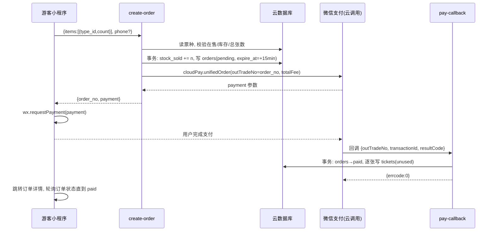
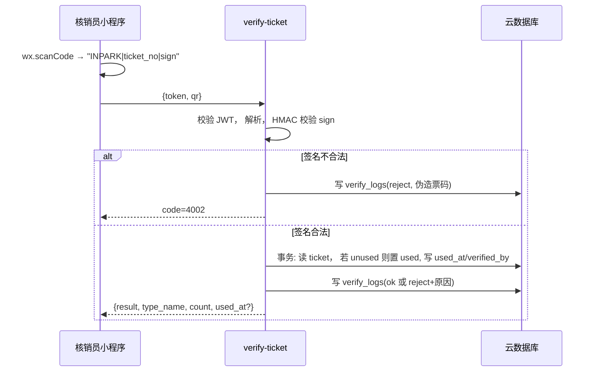
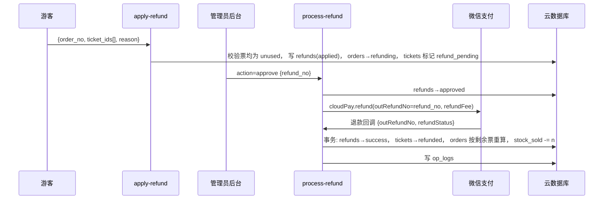
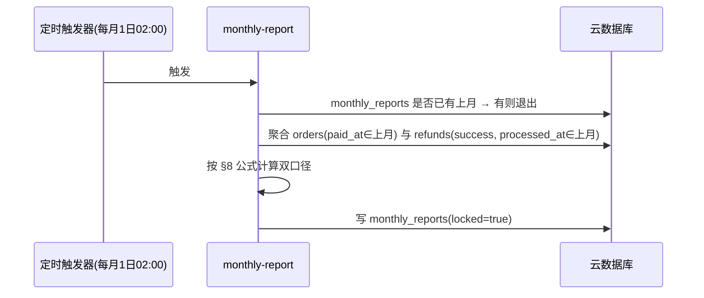
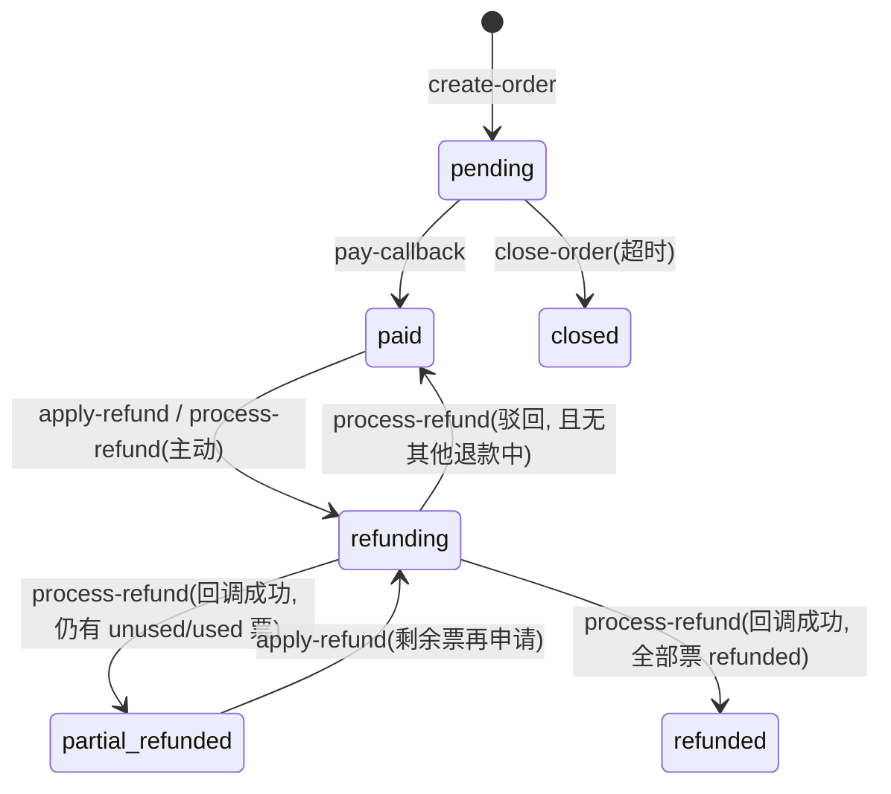
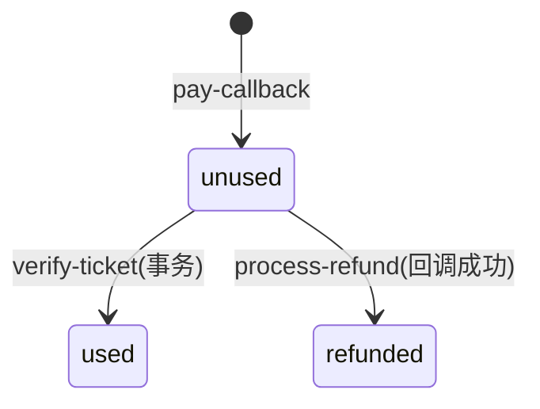
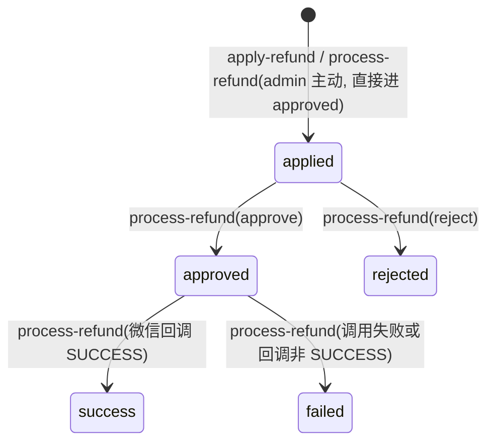

# inPARK 观光小火车购票小程序 · 详细设计文档

> 本文档是 `inpark-train-tech-spec.md`（以下简称 tech-spec）的下位文档。
> tech-spec 回答「做什么」，本文档回答「怎么做」，目标是开发人员拿到即可写代码。
> 分成方案：**方案 B**，全部资金进甲方（运营方）商户号，系统只生成月度分成报表（公园 25% / 运营方 75%），不做任何资金划转。
> 范围以 tech-spec §9「明确不做」为准，本文档不扩展范围。

---

## 1. 文档说明

### 1.1 阅读顺序

1. 先读 tech-spec 全文，建立范围与验收标准
2. 读本文档 §2 架构、§3 数据库、§4 云函数契约（开发主线）
3. 小程序开发读 §5，后台开发读 §6，支付接入读 §7，报表读 §8
4. 上线前读 §9 安全清单、§10 部署、§11 测试用例

### 1.2 术语

| 术语 | 含义 |
|---|---|
| 订单 order | 一次下单行为，含 1 到多张票，对应一笔微信支付 |
| 电子票 ticket | 订单支付成功后逐张生成的凭证，每张有独立票号和二维码，独立核销、独立退款 |
| 核销 verify | 核销员扫码或手输票号，把票从 unused 置为 used 的动作 |
| 核销员 verifier | 现场工作人员账号，在小程序内登录，只能核销 |
| 管理员 admin | Web 后台账号，管理票种、订单、退款、报表、账号 |
| 双口径 | 分成报表同时按「总流水」和「净流水」两种口径计算，供甲方与公园对账时选用 |
| 跨月退款 | 退款成功月份 ≠ 对应订单支付月份的退款，计入退款发生月并单列 |
| 云调用 | 微信云开发提供的免鉴权调用微信开放能力（本项目用于支付、退款） |

### 1.3 全局约定

| 项目 | 约定 |
|---|---|
| 金额 | 一律 `int`，单位分。展示时前端 `(fen / 100).toFixed(2)`。后端严禁出现浮点运算 |
| 时间 | 数据库存 `Date` 类型（云数据库原生支持）；接口返回 ISO 8601 字符串；所有「按月」「按日」统计以 `Asia/Shanghai` 时区切分 |
| 主键 | 使用云数据库自动生成的 `_id`；业务单号另存（`order_no` / `ticket_no` / `refund_no`），业务查询走业务单号 |
| 随机源 | 一律 `crypto.randomBytes`，不用 `Math.random` |
| 云函数响应 | 统一 `{ code: number, msg: string, data?: any }`；`code=0` 成功 |
| HTTP 响应（admin-api） | HTTP 状态恒为 200，业务结果放在 body 的 `code` 中；仅鉴权失败返回 HTTP 401 |
| 分页 | 入参 `page`（从 1 起）、`page_size`（默认 20，最大 100）；出参 `{ list, total, page, page_size }` |
| 环境变量 | 见 tech-spec §6，云函数内通过 `process.env` 读取，缺失即启动报错 |

### 1.4 错误码

错误码为 4 位整数，按千位分段。云函数与 admin-api 共用一张表。

| 区段 | 含义 | 已定义 |
|---|---|---|
| 0 | 成功 | `0` |
| 1xxx | 参数 / 通用 | `1001` 参数缺失或格式错误 · `1002` 未登录/身份无效 · `1003` 无权限 · `1004` 请求过于频繁 · `1005` 资源不存在 |
| 2xxx | 票种 / 库存 | `2001` 票种已下架 · `2002` 库存不足 · `2003` 单笔超过 10 张 |
| 3xxx | 订单 / 支付 | `3001` 订单不存在 · `3002` 订单状态不允许此操作 · `3003` 统一下单失败 · `3004` 订单已关闭 |
| 4xxx | 核销 | `4001` 二维码格式错误 · `4002` 签名校验失败（伪造票） · `4003` 票已使用 · `4004` 票已退款 · `4005` 票不存在 · `4006` 候选票多于 1 张需人工选择 |
| 5xxx | 退款 | `5001` 票状态不允许退款 · `5002` 退款单状态不允许此操作 · `5003` 微信退款调用失败 |
| 6xxx | 报表 | `6001` 该月报表已存在 · `6002` 该月尚未结束 |
| 9xxx | 系统 | `9001` 数据库错误 · `9002` 微信接口错误 · `9999` 未知错误 |

---

## 2. 架构与调用链

### 2.1 组件

```
┌────────────────────────── 微信小程序（同一个 AppID） ──────────────────────────┐
│  游客端页面（home/buy/orders/order-detail/refund）                              │
│  核销员页面（verify-login/verify/verify-records）—— 有 verifier token 才显示     │
└───────────────┬──────────────────────────────────────────────────────────────┘
                │ wx.cloud.callFunction
                ▼
┌──────────────────────────── 微信云开发 TCB ────────────────────────────────────┐
│ 云函数：create-order / pay-callback / close-order / apply-refund /               │
│         process-refund / verify-ticket / admin-api(HTTP) / monthly-report /     │
│         public-info / my-orders（只读，本文档新增）                               │
│ 云数据库：ticket_types orders tickets admins verify_logs refunds                 │
│           monthly_reports site_content op_logs login_attempts                   │
│ 定时触发器：close-order 每分钟；monthly-report 每月 1 日 02:00                     │
│ 静态托管：admin-web 构建产物                                                    │
│ 云调用：微信支付统一下单 / 退款（回调直接投递到云函数）                             │
└───────────────┬──────────────────────────────────────────────────────────────┘
                │ HTTPS（云开发 HTTP 访问服务）
                ▼
┌──────────────── Web 管理后台 Vue 3 + Vite ────────────────┐
│ Login Dashboard TicketTypes Orders Refunds VerifyLogs      │
│ Reports Content Accounts                                   │
└────────────────────────────────────────────────────────────┘
```

### 2.2 角色 × 入口 × 鉴权矩阵

| 调用方 | 入口 | 身份凭证 | 云函数内校验方式 |
|---|---|---|---|
| 游客 | 小程序 `callFunction` | 微信 openid（云函数上下文 `cloud.getWXContext().OPENID`） | 直接信任上下文 openid；操作订单时校验 `order.openid === OPENID` |
| 任何人 | 小程序 `callFunction` → `public-info` | 无 | 只读公开内容，无需鉴权 |
| 核销员 | 小程序 `callFunction` | verifier JWT（入参 `token`） | 校验 JWT 签名与过期；`role` 必须为 `verifier` 或 `admin` |
| 管理员 | Web 后台 → HTTP 访问服务 → `admin-api` | admin JWT（`Authorization: Bearer <jwt>`） | 校验 JWT；`role` 必须为 `admin`（Accounts 页）或 `admin`/`verifier`（仅 login 与查询自己记录） |
| 微信支付 | 云调用回调 → `pay-callback` / `process-refund` | 云开发平台投递，无需验签 | 校验 `returnCode`、`resultCode`，按 `outTradeNo` 查订单 |
| 定时器 | 触发器 → `close-order` / `monthly-report` | 无 | 仅允许触发器调用：判断 `event.TriggerName` 存在，否则拒绝 |

### 2.3 主时序

#### 2.3.1 购票支付



#### 2.3.2 核销



#### 2.3.3 退款



#### 2.3.4 月报



### 2.4 云开发资源清单

| 类型 | 名称 | 说明 |
|---|---|---|
| 集合 | `ticket_types` `orders` `tickets` `admins` `verify_logs` `refunds` `monthly_reports` `site_content` `op_logs` `login_attempts` | 权限全部设为「仅创建者可读写」之外的最严格项：**所有用户不可读写**（即仅云函数可读写） |
| 云函数 | 10 个（tech-spec 8 个 + 只读 `public-info` `my-orders`），见 §4、附录 A | Node.js 18，内存 256MB，超时 20s（pay-callback / verify-ticket 设 10s） |
| 定时触发器 | `close-order`：`0 * * * * * *`；`monthly-report`：`0 0 2 1 * * *` | 云开发 cron 为 7 段（秒 分 时 日 月 周 年） |
| HTTP 访问服务 | 路径 `/admin-api` → 云函数 `admin-api` | 后台唯一入口 |
| 静态托管 | `/` → admin-web `dist/` | 建议绑定自定义域名，无则用云开发默认域名 |
| 环境变量 | tech-spec §6 五项 | 在每个需要的云函数上单独配置 |

---

## 3. 数据库详细设计

字段类型：`string` `int` `bool` `Date` `array` `object`。「必填」指写入时必须存在。所有集合含 `created_at: Date`。

### 3.1 ticket_types 票种

| 字段 | 类型 | 必填 | 默认 | 说明 |
|---|---|---|---|---|
| `_id` | string | 是 | 自动 | |
| `name` | string | 是 | | 如「成人票」 |
| `price` | int | 是 | | 单价，分 |
| `description` | string | 否 | `''` | 票种说明 |
| `audience` | string | 否 | `''` | 适用人群，如「1.2m 以下儿童」 |
| `stock_total` | int | 是 | `-1` | `-1` 不限库存 |
| `stock_sold` | int | 是 | `0` | 已售（含预占）。可售 = `stock_total - stock_sold` |
| `status` | string | 是 | `'off'` | `'on'` / `'off'` |
| `sort` | int | 是 | `0` | 升序展示 |
| `created_at` / `updated_at` | Date | 是 | | |

索引：`status + sort`。

### 3.2 orders 订单

| 字段 | 类型 | 必填 | 说明 |
|---|---|---|---|
| `order_no` | string | 是 | 业务单号，**唯一索引**。格式 `yyMMdd` + 8 位数字随机，共 14 位，如 `26091053281974` |
| `openid` | string | 是 | 下单人 |
| `phone` | string | 否 | 可选手机号，仅用于后台查询 |
| `items` | array | 是 | `[{ type_id, type_name, price, count }]`，下单时快照 |
| `total_fee` | int | 是 | `Σ price × count`，分 |
| `ticket_count` | int | 是 | `Σ count`，冗余便于统计 |
| `status` | string | 是 | `pending` / `paid` / `closed` / `refunding` / `refunded` / `partial_refunded` |
| `wx_transaction_id` | string | 否 | 支付回调写入 |
| `paid_at` | Date | 否 | 支付回调写入，**报表按此归月** |
| `expire_at` | Date | 是 | `created_at + 15min` |
| `closed_at` | Date | 否 | 关单时间 |
| `created_at` / `updated_at` | Date | 是 | |

索引：`order_no`（唯一）、`openid + created_at desc`、`status + expire_at`（关单扫描）、`paid_at`（报表）、`phone`。



规则：`refunding` 表示「存在至少一张退款处理中的票」；驳回后若无其他 applied/approved 退款单，回到驳回前状态（`paid` 或 `partial_refunded`，按票状态重算，见 §4.5 步骤 8）。

### 3.3 tickets 电子票

| 字段 | 类型 | 必填 | 说明 |
|---|---|---|---|
| `ticket_no` | string | 是 | **唯一索引**。16 位，字符集 `23456789ABCDEFGHJKLMNPQRSTUVWXYZ`（去掉 0 O 1 I），`crypto.randomBytes` 生成 |
| `order_id` / `order_no` | string | 是 | |
| `openid` | string | 是 | 持票人 |
| `type_id` / `type_name` / `price` | | 是 | 快照 |
| `status` | string | 是 | `unused` / `used` / `refunded` |
| `refund_pending` | bool | 是 | 默认 `false`。有退款单 applied/approved 时为 `true`，此时**不可核销**、不可再申请退款 |
| `sign` | string | 是 | `HMAC-SHA256(ticket_no + order_no, TICKET_HMAC_SECRET)` 十六进制取前 16 位 |
| `used_at` | Date | 否 | |
| `verified_by` | string | 否 | 核销员 `admins._id` |
| `verified_by_name` | string | 否 | 核销员姓名快照 |
| `refunded_at` | Date | 否 | |
| `created_at` | Date | 是 | |

索引：`ticket_no`（唯一）、`order_id`、`openid`、`ticket_no_suffix`（见下）。

`ticket_no_suffix`：string，`ticket_no` 末 6 位，写入时冗余，供手输兜底查询。



`used` 与 `refunded` 均为终态。`refund_pending=true` 时 `unused` 票被核销请求拒绝（错误码 `5001` 语义「退款处理中」，前端提示「该票退款处理中，不可核销」）。

### 3.4 admins 账号

| 字段 | 类型 | 必填 | 说明 |
|---|---|---|---|
| `username` | string | 是 | **唯一索引**，3–32 位字母数字下划线 |
| `password_hash` | string | 是 | bcrypt，cost 10 |
| `role` | string | 是 | `admin` / `verifier` |
| `name` | string | 是 | 显示名 |
| `status` | string | 是 | `on` / `off`。`off` 账号登录返回 `1002` |
| `last_login_at` | Date | 否 | |
| `created_at` / `updated_at` | Date | 是 | |

### 3.5 verify_logs 核销记录

| 字段 | 类型 | 必填 | 说明 |
|---|---|---|---|
| `ticket_no` | string | 否 | 二维码格式错误时可能解析不出，允许空 |
| `order_no` / `type_name` | string | 否 | 票存在时写入 |
| `raw` | string | 否 | 扫码原始内容，截断 128 字符，仅 reject 时记录 |
| `result` | string | 是 | `ok` / `reject` |
| `reject_code` | int | 否 | 见 §1.4 4xxx |
| `reject_reason` | string | 否 | 中文原因 |
| `verifier_id` / `verifier_name` | string | 是 | |
| `created_at` | Date | 是 | |

索引：`created_at desc`、`verifier_id + created_at desc`、`ticket_no`。

### 3.6 refunds 退款单

| 字段 | 类型 | 必填 | 说明 |
|---|---|---|---|
| `refund_no` | string | 是 | **唯一索引**。`R` + `yyMMdd` + 8 位随机 |
| `order_id` / `order_no` | string | 是 | |
| `order_paid_at` | Date | 是 | 订单支付时间快照，**跨月判定用** |
| `ticket_ids` | array | 是 | 本次退款的 `tickets._id` 列表 |
| `ticket_nos` | array | 是 | 对应票号，便于展示 |
| `amount` | int | 是 | `Σ ticket.price` |
| `reason` | string | 是 | 游客填写；管理员主动退款时为管理员填写 |
| `source` | string | 是 | `customer` / `admin` |
| `status` | string | 是 | `applied` / `approved` / `rejected` / `success` / `failed` |
| `reject_reason` | string | 否 | 驳回原因 |
| `wx_refund_id` | string | 否 | 微信退款单号 |
| `operator_id` / `operator_name` | string | 否 | 审核/主动退款的管理员 |
| `fail_reason` | string | 否 | 微信退款失败原因 |
| `applied_at` | Date | 是 | |
| `processed_at` | Date | 否 | **退款成功回调时间，报表按此归月** |
| `created_at` / `updated_at` | Date | 是 | |

索引：`refund_no`（唯一）、`order_id`、`status + applied_at desc`、`processed_at`。



`failed` 后管理员可再次 approve 重试（重新调微信退款，`refund_no` 不变，微信侧幂等）。

### 3.7 monthly_reports 月度分成报表

| 字段 | 类型 | 说明 |
|---|---|---|
| `month` | string | `YYYY-MM`，**唯一索引** |
| `order_count` | int | 当月支付成功订单数 |
| `ticket_count` | int | 当月支付成功票数 |
| `gross` | int | 总流水 |
| `refund_count` | int | 当月成功退款单数 |
| `refund_ticket_count` | int | 当月成功退款票数 |
| `refund_amount` | int | 当月成功退款金额 |
| `cross_month_refund_count` / `cross_month_refund_amount` | int | 其中跨月退款 |
| `wx_fee` | int | 手续费估算 `round(gross × 0.006)` |
| `net` | int | `gross - refund_amount - wx_fee` |
| `park_ratio` / `operator_ratio` | int | `25` / `75`，写死在报表里便于日后比例变更仍可追溯 |
| `park_share_by_gross` / `operator_share_by_gross` | int | 总流水口径 |
| `park_share_by_net` / `operator_share_by_net` | int | 净流水口径 |
| `locked` | bool | 恒 `true` |
| `generated_by` | string | `timer` / 管理员 `_id` |
| `generated_at` | Date | |

### 3.8 site_content 运营内容（单文档 `_id='main'`）

字段同 tech-spec §2：`park_name` `intro` `open_hours` `address` `phone` `notice` `purchase_agreement` `announcement` `updated_at`。所有字段 string，`announcement` 为空串表示无公告。初始化时由种子脚本写入占位内容。

### 3.9 op_logs 操作日志

| 字段 | 类型 | 说明 |
|---|---|---|
| `admin_id` / `admin_name` | string | 操作人 |
| `action` | string | 与 admin-api action 同名，如 `refunds.approve` |
| `target` | string | 目标业务单号或 `_id` |
| `detail` | object | 变更前后关键字段，如 `{ before: { price: 3000 }, after: { price: 3500 } }` |
| `ip` | string | 请求来源 IP（HTTP 头 `X-Forwarded-For`） |
| `created_at` | Date | |

写日志的 action：`ticket-types.create/update/toggle`、`refunds.approve/reject/create`、`accounts.*`、`reports.generate`、`content.update`。

### 3.10 login_attempts 登录限频

| 字段 | 类型 | 说明 |
|---|---|---|
| `username` | string | 唯一索引 |
| `fail_count` | int | 窗口内失败次数 |
| `window_start` | Date | 窗口起点 |
| `locked_until` | Date | 非空且 > now 时拒绝登录 |

规则：10 分钟窗口内失败 5 次 → `locked_until = now + 10min`；登录成功清零。

### 3.11 库存原子操作与回滚点

```js
// 预占（create-order，事务内）
await t.collection('ticket_types').doc(type_id).update({
  data: { stock_sold: _.inc(count), updated_at: new Date() }
})
// 预占后立即回读校验（云数据库 update 不支持条件表达式）
const after = await t.collection('ticket_types').doc(type_id).get()
if (after.data.stock_total !== -1 && after.data.stock_sold > after.data.stock_total) {
  throw new BizError(2002)   // 事务回滚，inc 一并撤销
}
```

| 回滚点 | 触发函数 | 操作 |
|---|---|---|
| 超时关单 | `close-order` | `stock_sold -= order.items[i].count`，每个 type 一次 |
| 退款成功 | `process-refund`（回调分支） | 按本次退款票的 `type_id` 分组，`stock_sold -= 张数` |
| 统一下单失败 | `create-order` | 事务已提交后调微信失败：立即把订单置 `closed` 并回滚库存，返回 `3003` |

`stock_total` 由管理员从 `-1` 改为有限值时，不回填 `stock_sold`（已售数始终真实累计）。改小到 `< stock_sold` 时后台拒绝并提示。

---

## 4. 云函数接口契约

### 4.0 公共约定

**目录结构**（每个云函数独立 `package.json`，公共代码放 `cloudfunctions/common/`，部署时通过云开发「公共模块」或复制引用）：

```
/cloudfunctions
  /common
    db.js          # cloud.init, db, _ 导出
    errors.js      # BizError(code, msg?), ERR 码表
    auth.js        # signJwt / verifyJwt / requireRole
    id.js          # genOrderNo / genTicketNo / genRefundNo
    ticket-sign.js # sign(ticket_no, order_no) / verify(...)
    time.js        # 上海时区的 monthRange(YYYY-MM) / dayRange / toMonth(Date)
    resp.js        # ok(data) / fail(code, msg)
  /create-order  ... 每个函数 index.js + package.json (+ config.json 定时器)
```

**响应封装**：

```js
ok(data)            // { code: 0, msg: 'ok', data }
fail(code, msg?)    // { code, msg: msg ?? ERR[code] }
```

**BizError 处理**：每个函数入口 `try { ... } catch (e) { if (e instanceof BizError) return fail(e.code, e.msg); console.error(e); return fail(9999) }`。`pay-callback` 与退款回调分支例外，见各节。

**事务**：使用 `db.runTransaction(async t => {...})`。云数据库事务限制：只能对单文档 `get/update/set/remove`，不能用 `where` 批量更新，不能用聚合；事务内读到的数据即为快照，冲突时自动重试（SDK 默认最多 3 次，本项目显式设 `{ retries: 3 }` 语义等价）。因此凡是「读状态→改状态」的逻辑，一律先在事务外用 `where` 查出 `_id` 列表，再在事务内按 `_id` 逐个 `get` 复核 + `update`。

**JWT**：`HS256`，载荷 `{ sub: admins._id, username, name, role, iat, exp }`，有效期 24h，密钥 `JWT_SECRET`。

### 4.1 create-order

| 项目 | 内容 |
|---|---|
| 触发 | 小程序 `callFunction` |
| 鉴权 | openid（上下文） |

入参：

| 字段 | 类型 | 必填 | 校验 |
|---|---|---|---|
| `items` | array | 是 | 1–5 项；每项 `{ type_id: string, count: int }`，`count` 1–10；`Σ count ≤ 10`；`type_id` 不重复 |
| `phone` | string | 否 | 若给出必须匹配 `^1\d{10}$` |
| `agreed` | bool | 是 | 必须为 `true`（已勾选购票须知） |

出参 `data`：

```js
{ order_no, total_fee, expire_at,
  payment: { timeStamp, nonceStr, package, signType, paySign } }  // 直接传给 wx.requestPayment
```

错误码：`1001` `2001` `2002` `2003` `3003`。

实现步骤：

1. 校验入参格式；`agreed !== true` 返回 `1001`
2. 事务外读所有 `type_id` 对应票种，任一不存在或 `status !== 'on'` → `2001`；`stock_total !== -1 && stock_total - stock_sold < count` → `2002`（快速失败，最终以事务内判定为准）
3. 生成 `order_no = genOrderNo()`；构造 `items` 快照（`type_name`、`price` 取当前票种值）；`total_fee = Σ price × count`
4. **事务**：对每个 type `stock_sold` `_.inc(count)` 并回读校验（§3.11）；写 `orders` 文档 `{ status:'pending', expire_at: now+15min, ticket_count, ... }`
5. 调云调用统一下单（§7.2）。失败：事务外把订单置 `closed`、`closed_at=now`，按 items 回滚库存，返回 `3003`
6. 返回 `payment` 参数

订单号生成：

```js
function genOrderNo() {
  const d = dayjs().tz('Asia/Shanghai').format('YYMMDD')
  const n = crypto.randomBytes(4).readUInt32BE(0) % 1e8
  return d + String(n).padStart(8, '0')
}
```
冲突概率极低；仍在写入时依赖唯一索引，失败则重试生成一次。

### 4.2 pay-callback

| 项目 | 内容 |
|---|---|
| 触发 | 微信支付云调用回调（统一下单时 `functionName: 'pay-callback'`） |
| 鉴权 | 平台投递；函数内不接受小程序直接调用（检查 `event.outTradeNo` 存在且无 `OPENID` 上下文即可，或干脆不做小程序侧暴露） |

入参 `event`（云调用回调结构，关键字段）：

```js
{ returnCode: 'SUCCESS', resultCode: 'SUCCESS', outTradeNo, transactionId,
  totalFee: int, timeEnd: 'yyyyMMddHHmmss', openid, subMchId, ... }
```

返回：必须返回 `{ errcode: 0, errmsg: '' }` 表示已处理；返回其他 `errcode` 或抛错，微信会重试（间隔递增，最长约 24h）。

实现步骤：

1. `returnCode !== 'SUCCESS' || resultCode !== 'SUCCESS'` → 记录日志，返回 `{ errcode: 0 }`（支付失败无需重试，订单等待关单）
2. 按 `outTradeNo` 查订单；不存在 → 记录 `console.error`，返回 `{ errcode: 0 }`（避免无限重试）
3. **幂等**：`order.status === 'paid'` 或其他非 `pending` 已支付派生状态 → 直接返回 `{ errcode: 0 }`
4. 校验 `totalFee === order.total_fee`，不一致 → `console.error` 并返回 `{ errcode: 0 }`，同时把订单打标 `pay_amount_mismatch: true` 供人工处理（不生成票）
5. 若 `order.status === 'closed'`（用户在 15 分钟边界支付成功但已被关单）：**仍然置 paid 并生成票**，同时重新预占库存 `_.inc(count)`（不做库存校验，允许超卖 1 单，因为钱已收）；日志标记 `late_paid: true`
6. **事务**：`orders` 更新 `{ status:'paid', wx_transaction_id, paid_at: parse(timeEnd), updated_at }`；按 `items` 逐张 `t.collection('tickets').add(...)`，每张 `{ ticket_no: genTicketNo(), ticket_no_suffix, sign: sign(ticket_no, order_no), status:'unused', refund_pending:false, ... }`
7. 事务成功返回 `{ errcode: 0 }`；任何异常 `throw`，让微信重试（下次进入会命中步骤 3 幂等或重新执行）

票号生成：

```js
const ALPHABET = '23456789ABCDEFGHJKLMNPQRSTUVWXYZ'   // 32 字符，无 0/O/1/I
function genTicketNo() {
  const bytes = crypto.randomBytes(16)
  let s = ''
  for (let i = 0; i < 16; i++) s += ALPHABET[bytes[i] % 32]
  return s
}
```

### 4.3 close-order

| 项目 | 内容 |
|---|---|
| 触发 | 定时触发器 `0 * * * * * *` |
| 鉴权 | 仅 `event.TriggerName` 存在时执行 |

实现步骤：

1. 事务外 `where({ status:'pending', expire_at: _.lt(now) }).limit(100).field({_id:true})` 取候选
2. 对每个候选**单独事务**：`get` 复核 `status === 'pending'`（防止与 pay-callback 竞争），是则 `update({ status:'closed', closed_at: now })` 并按 items 回滚库存
3. 复核失败（已 paid）跳过；单个失败不影响其余
4. 输出处理数量到日志

### 4.4 apply-refund

| 项目 | 内容 |
|---|---|
| 触发 | 小程序 `callFunction` |
| 鉴权 | openid，且 `order.openid === OPENID` |

入参：

| 字段 | 类型 | 必填 | 说明 |
|---|---|---|---|
| `order_no` | string | 是 | |
| `ticket_ids` | array | 是 | 1 到 N 个 `tickets._id`；整单退时传全部 unused 票 |
| `reason` | string | 是 | 2–200 字 |

出参 `data`：`{ refund_no, amount }`。错误码：`3001` `1003` `5001` `3002`。

实现步骤：

1. 查订单，不存在 `3001`；`openid` 不符 `1003`；`status` 不在 `paid` / `partial_refunded` → `3002`
2. 查 `ticket_ids` 对应票，必须全部属于该订单、`status === 'unused'`、`refund_pending === false`，否则 `5001`
3. `amount = Σ price`；`refund_no = genRefundNo()`
4. **事务**：写 `refunds { status:'applied', source:'customer', order_paid_at: order.paid_at, applied_at: now, ... }`；每张票 `refund_pending = true`；`orders.status = 'refunding'`
5. 返回

### 4.5 process-refund

| 项目 | 内容 |
|---|---|
| 触发 | ① `admin-api` 内部调用（`cloud.callFunction`），action 为 `approve` / `reject` / `create`；② 微信退款云调用回调（`functionName: 'process-refund'`） |
| 鉴权 | ① 由 admin-api 完成 JWT 校验后传入 `operator: { id, name }`，本函数校验 `event.internal_token === JWT_SECRET` 防止小程序直呼；② 回调按 `event.outRefundNo` 存在判断 |

入参（分支 ①）：

| 字段 | 类型 | 说明 |
|---|---|---|
| `action` | string | `approve` / `reject` / `create` |
| `refund_no` | string | approve / reject 用 |
| `reject_reason` | string | reject 用 |
| `order_no` / `ticket_ids` / `reason` | | create 用（管理员主动退款） |
| `operator` | object | `{ id, name }` |

实现步骤：

**approve**
1. 查退款单，`status` 必须为 `applied` 或 `failed` → 否则 `5002`
2. 更新 `status:'approved', operator_id/name, updated_at`
3. 调云调用退款（§7.3）：`outTradeNo = order_no`，`outRefundNo = refund_no`，`totalFee = order.total_fee`，`refundFee = refund.amount`
4. 调用返回 `resultCode !== 'SUCCESS'`：`status:'failed', fail_reason`，返回 `5003`；调用成功：等待回调
5. 写 `op_logs { action:'refunds.approve', target: refund_no }`

**reject**
1. `status` 必须为 `applied`
2. **事务**：`refunds.status='rejected', reject_reason, operator, processed_at=now`；所有 `ticket_ids` 的 `refund_pending=false`
3. 重算订单状态（步骤 8）；写 `op_logs`

**create**（管理员主动退款）
1. 与 apply-refund 步骤 1–4 相同校验（跳过 openid 校验），`source:'admin'`，`reason` 由管理员填写
2. 写入后直接执行 approve 流程
3. 写 `op_logs { action:'refunds.create' }`

**回调分支**（`event.outRefundNo` 存在）
1. 按 `outRefundNo` 查退款单，不存在返回 `{ errcode: 0 }`
2. **幂等**：`status === 'success'` 直接返回 `{ errcode: 0 }`
3. `refundStatus !== 'SUCCESS'` → `status:'failed', fail_reason: refundStatus`，返回 `{ errcode: 0 }`
4. **事务**：`refunds { status:'success', wx_refund_id: refundId, processed_at: now }`；每张票 `{ status:'refunded', refund_pending:false, refunded_at: now }`
5. 事务外：按 `type_id` 分组回滚库存 `_.inc(-n)`
6. 重算订单状态（步骤 8）
7. 返回 `{ errcode: 0 }`；异常 `throw` 让微信重试

**步骤 8 订单状态重算**（公共函数 `recomputeOrderStatus(order_id)`）：

```
读该订单全部票
若存在 refund_pending=true 的票             → refunding
否则若全部票 status=refunded                → refunded
否则若存在 status=refunded 的票             → partial_refunded
否则                                        → paid
```

### 4.6 verify-ticket

| 项目 | 内容 |
|---|---|
| 触发 | 小程序 `callFunction` |
| 鉴权 | `token`（verifier 或 admin JWT） |
| 性能 | 目标 P95 < 1s；只做 1 次事务 + 1 次日志写入 |

入参：

| 字段 | 类型 | 说明 |
|---|---|---|
| `token` | string | JWT |
| `mode` | string | `scan` / `lookup` / `manual` |
| `qr` | string | `mode=scan`：扫码原文 |
| `suffix` | string | `mode=lookup`：票号末 6 位（大写化后匹配） |
| `ticket_no` | string | `mode=manual`：lookup 选定后的完整票号 |

出参 `data`：

```js
// 成功核销
{ result:'ok', ticket_no, type_name, order_no, order_ticket_count, used_at }
// 拒绝（code 非 0，data 仍带上下文）
{ result:'reject', ticket_no?, type_name?, used_at?, verified_by_name? }
// mode=lookup
{ candidates: [{ ticket_no, type_name, status, order_no, created_at }] }   // 最多 10 条，按 created_at desc
```

错误码：`1002` `4001` `4002` `4003` `4004` `4005` `5001`。

实现步骤（`scan` / `manual`）：

1. `verifyJwt(token)` 失败 → `1002`
2. `scan`：按 `|` 拆分，必须 3 段且首段 `INPARK` → 否则写 `verify_logs(reject, 4001, raw)` 返回 `4001`
3. `scan`：`sign(ticket_no, order_no)` 需要 `order_no`，而二维码不含 order_no，因此改为：先按 `ticket_no` 查票，取其 `order_no` 再计算并比对 `sign`（`crypto.timingSafeEqual`）。票不存在 → `4005`；签名不符 → `4002`。**注意**：票不存在与签名不符都视为伪造，前端文案统一「票码无效」，日志区分码
4. `manual`：按 `ticket_no` 查票，不存在 `4005`
5. **事务**：`t.get(ticket._id)` 复核；`status==='used'` → `4003`（返回 `used_at`、`verified_by_name`）；`status==='refunded'` → `4004`；`refund_pending` → `5001`；`unused` → `update({ status:'used', used_at: now, verified_by, verified_by_name })`
6. 事务外写 `verify_logs`（成功或拒绝都写）
7. 返回；`order_ticket_count` 取订单 `ticket_count` 用于前端展示「本单共 N 张」

`lookup`：`where({ ticket_no_suffix: suffix.toUpperCase() })`，返回候选，不改状态、不写日志。

### 4.7 admin-api

| 项目 | 内容 |
|---|---|
| 触发 | 云开发 HTTP 访问服务 `POST /admin-api` |
| 鉴权 | 除 `login` 外均需 `Authorization: Bearer <jwt>` |
| 请求体 | `{ action: string, params: object }` |
| 响应 | `{ code, msg, data }`；JWT 无效/过期 HTTP 401 |

CORS：响应头 `Access-Control-Allow-Origin` 设为后台静态托管域名；`OPTIONS` 直接 204。

限频：`login` 按 `login_attempts` 集合（§3.10）；其他 action 不限频。

action 总表（`R` 需 role=admin，`V` verifier 亦可）：

| action | 权限 | params | data |
|---|---|---|---|
| `login` | 无 | `{ username, password, client: 'web'|'mp' }` | `{ token, role, name, expires_at }`。`client='web'` 只允许 admin；`client='mp'` 允许 admin/verifier |
| `dashboard.stats` | R | `{}` | `{ today:{ orders, tickets, revenue, verified }, month:{...同}, trend:[{ date, revenue, tickets }] ×30 }` |
| `ticket-types.list` | R | `{}` | `{ list }` 全部票种含下架 |
| `ticket-types.create` | R | `{ name, price, description, audience, stock_total, sort }` | `{ _id }` |
| `ticket-types.update` | R | `{ _id, ...同上 }` | 改 `stock_total` 小于 `stock_sold` 拒绝 `1001` |
| `ticket-types.toggle` | R | `{ _id, status }` | |
| `orders.list` | R | `{ page, page_size, status?, order_no?, phone?, ticket_no?, date_from?, date_to? }` | 分页；`ticket_no` 先查票取 `order_id` |
| `orders.detail` | R | `{ order_no }` | `{ order, tickets, refunds }` |
| `refunds.list` | R | `{ page, page_size, status?, date_from?, date_to? }` | 分页 |
| `refunds.approve` | R | `{ refund_no }` | 转调 process-refund |
| `refunds.reject` | R | `{ refund_no, reject_reason }` | 转调 |
| `refunds.create` | R | `{ order_no, ticket_ids, reason }` | 转调 |
| `verify-logs.list` | R | `{ page, page_size, verifier_id?, result?, date_from?, date_to? }` | 分页 |
| `verify-logs.mine` | V | `{ page, page_size, date? }` | 当前核销员自己的记录（小程序核销记录页用） |
| `reports.list` | R | `{}` | 全部月报，按 month desc |
| `reports.detail` | R | `{ month }` | 报表文档 |
| `reports.generate` | R | `{ month }` | 补生成；已存在 `6001`；月未结束 `6002`；转调 monthly-report |
| `reports.orders-export` | R | `{ month }` | 当月所有 `paid_at ∈ month` 订单 + 当月成功退款单，前端拼 Excel；最多 5000 条，超出分页 `page` |
| `content.get` | R | `{}` | site_content |
| `content.update` | R | `{ ...字段 }` | 写 op_logs |
| `accounts.list` | R | `{}` | 不返回 `password_hash` |
| `accounts.create` | R | `{ username, password, role, name }` | 密码 8–32 位 |
| `accounts.toggle` | R | `{ _id, status }` | 不能停用自己 |
| `accounts.reset-password` | R | `{ _id, password }` | |
| `op-logs.list` | R | `{ page, page_size }` | 供审计，后台可放在 Accounts 页下方 |

路由实现：`const handlers = { 'login': ..., 'orders.list': ... }`；入口解析 JWT → 查 `handlers[action]` → 校验 role → 调用。每个 handler 独立文件放 `admin-api/actions/`。

`dashboard.stats` 计算：`today`/`month` 用 `Asia/Shanghai` 的 `dayRange`/`monthRange`；`revenue` = 当期 `paid_at` 订单 `total_fee` 之和（不扣退款，与报表 gross 口径一致）；`verified` = 当期 `verify_logs.result='ok'` 数；`trend` 用聚合 `$match paid_at ∈ 近30天` + `$group by 日期字符串`（`$dateToString` 指定 `timezone: 'Asia/Shanghai'`）。

### 4.8 monthly-report

| 项目 | 内容 |
|---|---|
| 触发 | ① 定时 `0 0 2 1 * * *`；② admin-api `reports.generate` 内部调用（带 `internal_token`、`month`、`operator`） |
| 幂等 | `monthly_reports.month` 唯一索引；写入前查存在则退出 |

实现步骤：

1. 确定 `month`：定时 = 上海时区「上个月」；手动 = 入参，必须 `< 当前月`
2. 已存在 → 定时静默退出 / 手动返回 `6001`
3. `[start, end) = monthRange(month)`
4. 聚合 orders：`paid_at ∈ [start,end)` 且 `status ∈ paid/refunding/refunded/partial_refunded` → `order_count`、`ticket_count = Σ ticket_count`、`gross = Σ total_fee`
5. 聚合 refunds：`status='success'` 且 `processed_at ∈ [start,end)` → `refund_count`、`refund_ticket_count = Σ len(ticket_ids)`、`refund_amount = Σ amount`；其中 `toMonth(order_paid_at) !== month` 的子集 → `cross_month_refund_*`
6. 按 §8 公式计算
7. 写 `monthly_reports { locked:true, generated_by, generated_at }`
8. 手动触发时写 `op_logs { action:'reports.generate' }`

---

## 5. 小程序端设计

技术：原生小程序 + TypeScript，`wx.cloud.init({ env: ENV_ID })`。不引入 UI 框架，用自定义少量组件；二维码用 `weapp-qrcode-canvas-2d`（或同类 canvas 2d 库）。

### 5.1 页面与路由

| 路径 | 页面 | tabBar | 角色 |
|---|---|---|---|
| `pages/home/home` | 首页 | 是（首页） | 所有人 |
| `pages/buy/buy` | 选票下单 | 否 | 游客 |
| `pages/orders/orders` | 我的订单 | 是（订单） | 游客 |
| `pages/order-detail/order-detail` | 订单详情 / 电子票 | 否 | 游客 |
| `pages/refund/refund` | 退票申请 | 否 | 游客 |
| `pages/verify-login/verify-login` | 核销员登录 | 否 | 核销员 |
| `pages/verify/verify` | 扫码核销 | 否 | 核销员 |
| `pages/verify-records/verify-records` | 核销记录 | 否 | 核销员 |

角色判定：`app.globalData.verifierToken = wx.getStorageSync('verifier_token')`；非空且未过期（解 JWT `exp`）→ 首页右上角显示「核销」入口，进入 `verify`；否则首页底部小字「员工入口」→ `verify-login`。核销员登录后 `verify` 页有「退出」清除 storage。

### 5.2 公共封装 `utils/api.ts`

```ts
export async function call<T>(name: string, data: object): Promise<T> {
  const res = await wx.cloud.callFunction({ name, data })
  const r = res.result as { code: number; msg: string; data: T }
  if (r.code !== 0) throw new ApiError(r.code, r.msg, r.data)
  return r.data
}
export async function adminApi<T>(action: string, params: object): Promise<T>  // 核销员登录/记录用，POST HTTP 访问服务
```

统一错误提示：`ApiError` 在页面层 `catch` 后 `wx.showToast({ icon:'none', title: e.msg })`；`1002` 时清 token 并跳转登录页。

### 5.3 首页 home

- 数据：`call('public-info', {})`。`public-info` 是本文档在 tech-spec 8 个函数之外新增的只读云函数（见附录 A），无鉴权，返回 `{ content: site_content, ticket_types: [仅 status=on，字段裁剪为 _id/name/price/description/audience/sold_out] }`
- 展示：顶部 `announcement` 非空时红色横幅；园区名、简介、开放时间、地址（点击 `wx.openLocation` 需经纬度，本期只展示文字）、电话（`wx.makePhoneCall`）、乘车须知折叠
- 按钮「立即购票」→ `buy`；「我的订单」→ tab 切换
- 状态：加载中骨架；失败显示重试按钮

### 5.4 选票下单 buy

- 进入时调 `public-info` 取票种；每种票 `- 数 +` 步进器，`sold_out` 置灰
- 底部合计金额（分转元）与「共 N 张」；`N > 10` 时按钮禁用并提示
- 可选手机号输入（校验 11 位）
- 「购票须知」勾选框，点击文字弹出 `purchase_agreement` 全文；未勾选按钮禁用
- 点「去支付」：
  1. `call('create-order', { items, phone, agreed:true })`
  2. `wx.requestPayment(payment)`
  3. 成功 → `redirectTo order-detail?order_no=`；`fail` 且 `errMsg` 含 `cancel` → toast「已取消支付」并 `redirectTo order-detail`（订单 pending，可在详情页「继续支付」）；其他失败 → toast 错误
- 错误码映射：`2002` 提示「XX 票库存不足」并刷新票种；`2001` 同上

**继续支付**：`order-detail` 页对 `pending` 订单提供「继续支付」，调用新增 action：`create-order` 增加入参 `repay_order_no`，函数内校验订单 pending 且未过期、`openid` 匹配后**重新调用统一下单**（同 `outTradeNo`，微信允许未支付订单重复下单）并返回 payment。

### 5.5 我的订单 orders

- `call('my-orders', { page })`：新增第 10 个只读云函数 `my-orders`（按 openid 分页查订单，附每单票状态计数）
- 列表卡片：单号、时间、票种×数量、金额、状态标签（颜色：pending 橙、paid 绿、closed 灰、refund* 蓝）
- 下拉刷新、上拉加载

> 说明：`public-info` 与 `my-orders` 为纯查询函数，从 tech-spec 未列出的原因是 tech-spec 假设小程序直接读库；本文档遵守「所有集合仅云函数可读写」，因此补充这两个函数。

### 5.6 订单详情 order-detail

- 入参 `order_no`；调 `my-orders` 的 `detail` 分支 `{ order_no }` 返回 `{ order, tickets }`
- `pending`：显示倒计时（`expire_at - now`）与「继续支付」；到 0 自动刷新
- `paid`/`partial_refunded`/`refunding`：
  - 页面进入 `wx.setKeepScreenOn({ keepScreenOn: true })`，离开时关闭
  - `swiper` 横向切票，每页：票种名、票号（4 位一组显示）、状态章（已使用/已退款/退款中 半透明覆盖）、二维码
  - 二维码内容 `INPARK|${ticket_no}|${sign}`，尺寸 ≥ 240px 逻辑像素
  - 底部「申请退票」（存在 unused 且非 refund_pending 的票时显示）→ `refund?order_no=`
- 轮询：从支付页跳转过来时若 `status=pending`，每 2s 刷新，最多 15 次，等待回调落库

### 5.7 退票申请 refund

- 列出可退票（unused 且非 refund_pending），多选，默认全选；显示合计退款金额
- 原因文本框（2–200 字）
- 提交 `call('apply-refund', ...)` → 成功提示「已提交，等待审核」返回详情

### 5.8 核销员登录 verify-login

- 用户名、密码 → `adminApi('login', { username, password, client:'mp' })`
- 成功存 `verifier_token`、`verifier_name`，`redirectTo verify`
- 失败提示 msg；`1004` 提示「失败次数过多，10 分钟后再试」

### 5.9 扫码核销 verify

- 页面结构：顶部当前核销员姓名 + 今日已核销数（`verify-logs.mine` 当天 count）；中间大按钮「扫码核销」；下方「手输票号」入口；「核销记录」入口
- 扫码：`wx.scanCode({ onlyFromCamera: true, scanType: ['qrCode'] })` → `call('verify-ticket', { token, mode:'scan', qr })`
- 结果页（同页覆盖层，全屏）：
  - 成功：绿色背景，白字「核销成功」80rpx，票种名 + 「本单共 N 张」，`used_at`；震动 `wx.vibrateShort`；3 秒后自动关闭或点击关闭，关闭后自动再次唤起扫码
  - 失败：红色背景，白字「核销失败」+ 原因；`4003` 附「首次核销 HH:mm 由 XX」；不自动关闭，需点击
- 手输兜底：弹层输入末 6 位（大写、自动去空格）→ `mode:'lookup'` → 候选列表（票种、票号、状态、下单时间）→ 点选 → 二次确认「确认核销 ABCD-EFGH-...？」→ `mode:'manual'`
- 网络异常（`callFunction` 抛错非 ApiError）：红色提示「网络异常，请重试」，不写任何本地状态。**本项目不做离线核销**（票状态必须以服务端为准）

### 5.10 核销记录 verify-records

- `adminApi('verify-logs.mine', { page, date })`，默认今天，可切换日期
- 列表：时间、票号末 6 位、票种、结果（绿/红）、拒绝原因

---

## 6. 管理后台设计（admin-web）

技术：Vue 3 + Vite + TypeScript + Vue Router + Pinia + Element Plus + ECharts + SheetJS（xlsx）。部署到云开发静态托管。

### 6.1 路由与守卫

| 路径 | 视图 | role |
|---|---|---|
| `/login` | Login | 公开 |
| `/` | Dashboard | admin |
| `/ticket-types` | TicketTypes | admin |
| `/orders` `/orders/:order_no` | Orders / OrderDetail | admin |
| `/refunds` | Refunds | admin |
| `/verify-logs` | VerifyLogs | admin |
| `/reports` `/reports/:month` | Reports / ReportDetail | admin |
| `/content` | Content | admin |
| `/accounts` | Accounts（含操作日志 tab） | admin |

守卫：`beforeEach` 无 token 或 token `exp` 过期 → `/login`。`client='web'` 登录只允许 admin，因此后台不需要按 verifier 隐藏菜单；核销员不能登录 Web 后台。

### 6.2 请求封装 `src/api/index.ts`

```ts
const BASE = import.meta.env.VITE_ADMIN_API   // https://<env-id>.service.tcloudbase.com/admin-api
export async function api<T>(action: string, params = {}): Promise<T> {
  const r = await fetch(BASE, { method:'POST',
    headers:{ 'Content-Type':'application/json', Authorization:`Bearer ${store.token}` },
    body: JSON.stringify({ action, params }) })
  if (r.status === 401) { store.logout(); router.push('/login'); throw new Error('登录已过期') }
  const j = await r.json()
  if (j.code !== 0) { ElMessage.error(j.msg); throw new ApiError(j.code, j.msg) }
  return j.data
}
```

### 6.3 各页面

**Login**：用户名/密码；成功存 `localStorage.admin_token` 与 `expires_at`；`1004` 提示锁定。

**Dashboard**：四个统计卡（今日售票数 / 今日核销数 / 今日营收 / 本月营收），下方 ECharts 折线（近 30 天营收、票数双轴）。数据 `dashboard.stats`，进入页面拉一次，提供刷新按钮。

**TicketTypes**：表格列 名称 / 价格(元) / 适用人群 / 库存(已售/总量, -1 显示「不限」) / 状态 / 排序 / 操作(编辑、上架/下架)。新建/编辑弹窗，价格输入元、提交转分（`Math.round(yuan*100)`）。改价提示「已售订单不受影响」。

**Orders**：筛选 时间范围 / 状态 / 单号 / 手机号 / 票号；表格列 单号 / 下单时间 / 支付时间 / 票 / 金额 / 状态 / 操作(详情)。详情页：订单信息 + 票列表（票号、票种、状态、核销时间/核销员、退款时间）+ 该单退款单列表 + 「主动退款」按钮（选择 unused 票、填原因 → `refunds.create`，二次确认）。

**Refunds**：筛选 状态 / 时间；表格列 退款单号 / 订单号 / 票数 / 金额 / 来源 / 申请时间 / 状态 / 操作人 / 操作。`applied` 行显示「通过」「驳回」（驳回需填原因）；`failed` 行显示「重试」（= approve）与失败原因。

**VerifyLogs**：筛选 日期 / 核销员 / 结果；表格列 时间 / 票号 / 票种 / 订单号 / 结果 / 原因 / 核销员。

**Reports**：列表 月份 / 订单数 / 总流水 / 退款 / 净流水 / 公园分成(总流水口径) / 公园分成(净流水口径) / 生成时间 / 操作(查看)。顶部「补生成」按钮选月份 → `reports.generate`。详情页：两列卡片并排展示双口径全部字段（§8 表格），按钮「导出报表 Excel」「导出订单明细 Excel」。**无任何编辑控件。**

**Content**：表单编辑 site_content 全部字段；`notice`/`purchase_agreement`/`intro` 用多行文本（纯文本，换行保留；不做富文本）；保存 `content.update`。

**Accounts**：表格 用户名 / 姓名 / 角色 / 状态 / 最近登录 / 操作(停用启用、重置密码)；新建弹窗。第二个 tab「操作日志」`op-logs.list`。

### 6.4 Excel 导出（SheetJS）

**报表 Excel**（`报表-YYYY-MM.xlsx`，一个 sheet，金额转元两位小数）：

| 行 | 内容 |
|---|---|
| 1 | 项目 / 数值 / 说明 |
| 2–5 | 订单数、票数、总流水、退款单数 |
| 6–8 | 退款票数、退款金额、其中跨月退款金额 |
| 9 | 微信手续费（估算 0.6%） |
| 10 | 净流水 |
| 11–12 | 公园分成(总流水口径 25%) / 运营方分成(总流水口径 75%) |
| 13–14 | 公园分成(净流水口径 25%) / 运营方分成(净流水口径 75%) |
| 15 | 生成时间 |

**订单明细 Excel**（`订单明细-YYYY-MM.xlsx`，两个 sheet）：

- sheet「订单」：订单号 / 支付时间 / 微信交易号 / 票种明细(`成人票×2;儿童票×1`) / 票数 / 金额(元) / 当前状态 / 手机号
- sheet「退款」：退款单号 / 订单号 / 订单支付时间 / 退款成功时间 / 是否跨月 / 票数 / 金额(元) / 来源 / 操作人

---

## 7. 微信支付接入

### 7.1 前置条件（甲方配合，D1 前完成）

1. 小程序以企业主体完成认证（300 元/年）
2. 微信支付商户号已开通（企业营业执照 + 对公账户），且在商户平台「产品中心 → AppID 账号管理」中关联本小程序 AppID
3. 云开发控制台 → 设置 → 「微信支付」→ 添加商户号并授权（云调用支付）
4. **D1 必查项**：若云开发控制台已不提供「微信支付」云调用开通入口（微信侧曾调整该能力的开放范围），立即切换 §7.4 备选方案，不影响接口契约

### 7.2 统一下单（云调用）

```js
const res = await cloud.cloudPay.unifiedOrder({
  body: 'inPARK小火车-电子票',
  outTradeNo: order_no,
  spbillCreateIp: '127.0.0.1',
  subMchId: process.env.WX_MCH_ID,     // 普通商户模式下此处填商户号
  totalFee: order.total_fee,           // 分
  envId: process.env.ENV_ID,
  functionName: 'pay-callback',
  nonceStr: crypto.randomBytes(16).toString('hex'),
  tradeType: 'JSAPI',
  timeExpire: dayjs(order.expire_at).format('YYYYMMDDHHmmss')   // 与关单时间对齐
})
// res.returnCode === 'SUCCESS' && res.resultCode === 'SUCCESS'
// res.payment = { appId, timeStamp, nonceStr, package, signType, paySign }
```

返回给小程序 `payment`（去掉 `appId`，`wx.requestPayment` 不需要）。

### 7.3 退款（云调用）

```js
const res = await cloud.cloudPay.refund({
  subMchId: process.env.WX_MCH_ID,
  nonceStr: crypto.randomBytes(16).toString('hex'),
  outTradeNo: order_no,
  outRefundNo: refund_no,
  totalFee: order.total_fee,
  refundFee: refund.amount,
  envId: process.env.ENV_ID,
  functionName: 'process-refund'
})
```

回调 `event` 关键字段：`{ returnCode, outRefundNo, outTradeNo, refundId, refundFee, refundStatus: 'SUCCESS'|'CHANGE'|'REFUNDCLOSE', successTime }`。

同一订单多次部分退款：每次 `outRefundNo` 不同、`totalFee` 恒为订单原金额、`refundFee` 为本次金额，累计不得超过 `totalFee`（微信侧校验，我方在 apply 阶段已保证）。

### 7.4 备选：微信支付 API v3

若云调用不可用：

- 依赖 `wechatpay-node-v3`；新增环境变量 `WX_APPID` `WX_MCH_SERIAL_NO` `WX_API_V3_KEY` `WX_MCH_PRIVATE_KEY`（PEM 内容，base64 后放环境变量）
- 统一下单：`POST /v3/pay/transactions/jsapi`，`notify_url` 指向云开发 HTTP 访问服务路径 `/pay-callback`（需为 `pay-callback` 开 HTTP 访问）；小程序支付参数由我方按 v3 规则签名生成
- 回调：验证 `Wechatpay-Signature`，AES-256-GCM 解密 `resource` 得到 `out_trade_no` `transaction_id` `trade_state`；处理逻辑与 §4.2 步骤 2–7 相同；成功返回 HTTP 204 或 `{ code:'SUCCESS' }`
- 退款：`POST /v3/refund`，`notify_url` → `/process-refund`
- 封装为 `common/pay.js` 暴露 `unifiedOrder(order)` / `refund(refund, order)` / `parsePayCallback(event)` / `parseRefundCallback(event)`，两种实现二选一，上层函数不感知

### 7.5 联调清单

- [ ] 票种设 1 分钱测试票，真机完成支付，`orders.paid_at` 与 `tickets` 落库
- [ ] 支付页取消，订单保持 pending，15 分钟后被 close-order 关闭且库存回滚
- [ ] pending 订单「继续支付」成功
- [ ] 后台通过退款，微信零钱/银行卡到账，`refunds.success`、票 `refunded`、库存回滚
- [ ] 同一订单两次部分退款均成功
- [ ] 人为让 pay-callback 抛错一次，观察微信重试后订单最终 paid 且票不重复生成

---

## 8. 月度分成报表计算规范

### 8.1 口径定义

| 指标 | 定义 |
|---|---|
| `gross` | 支付时间 `paid_at` 落在本月的订单 `total_fee` 之和，**不论该订单后来是否退款** |
| `refund_amount` | 退款成功时间 `processed_at` 落在本月、`status='success'` 的退款单 `amount` 之和，**不论对应订单是哪个月支付的** |
| `cross_month_refund_amount` | `refund_amount` 中，`toMonth(order_paid_at) ≠ month` 的部分 |
| `wx_fee` | `Math.round(gross × 6 / 1000)`，整数运算；报表标注「估算，以微信商户平台账单为准」 |
| `net` | `gross − refund_amount − wx_fee` |
| `park_share_by_gross` | `Math.round(gross × 25 / 100)` |
| `operator_share_by_gross` | `gross − park_share_by_gross`（差额法，两者之和恒等于 gross） |
| `park_share_by_net` | `Math.round(net × 25 / 100)`；`net` 可能为负（退款集中月），照算不截断 |
| `operator_share_by_net` | `net − park_share_by_net` |

「本月」用 `Asia/Shanghai` 时区判定：`monthRange('2026-10')` = `[2026-10-01T00:00:00+08:00, 2026-11-01T00:00:00+08:00)`。

### 8.2 示例

2026-10 数据：

| 订单 | 支付时间 | 金额 |
|---|---|---|
| A | 10-03 | 6000（成人 3000×2） |
| B | 10-15 | 4500（成人 3000 + 儿童 1500） |
| C | 10-28 | 3000 |

退款（成功时间均在 10 月）：

| 退款单 | 订单 | 订单支付月 | 金额 | 跨月 |
|---|---|---|---|---|
| R1 | B | 2026-10 | 1500 | 否 |
| R2 | Z（9 月订单） | 2026-09 | 3000 | **是** |

计算：

```
gross                    = 6000 + 4500 + 3000 = 13500
refund_amount            = 1500 + 3000 = 4500
cross_month_refund_amount= 3000
wx_fee                   = round(13500 × 6 / 1000) = round(81) = 81
net                      = 13500 − 4500 − 81 = 8919
park_share_by_gross      = round(13500 × 25 / 100) = 3375
operator_share_by_gross  = 13500 − 3375 = 10125          (3375 + 10125 = 13500 ✓)
park_share_by_net        = round(8919 × 25 / 100) = round(2229.75) = 2230
operator_share_by_net    = 8919 − 2230 = 6689             (2230 + 6689 = 8919 ✓)
```

展示为元：总流水 135.00，退款 45.00（其中跨月 30.00），手续费 0.81，净流水 89.19；公园 33.75 / 101.25（总流水口径），22.30 / 66.89（净流水口径）。

### 8.3 锁定

- `monthly_reports` 无任何 update/delete 的 action；`admin-api` 路由表中不存在 `reports.update`
- 若口径需修正，只能由开发人员在数据库控制台删除该月文档后重新 `reports.generate`，并在 op_logs 手工补记；此为运维操作，不提供界面

---

## 9. 安全实现清单

| 项 | 实现 |
|---|---|
| 票码防伪 | `sign = crypto.createHmac('sha256', TICKET_HMAC_SECRET).update(ticket_no + order_no).digest('hex').slice(0,16)`；比对用 `crypto.timingSafeEqual`；`TICKET_HMAC_SECRET` ≥ 32 字节随机，泄露即需全量重签（提供脚本 `scripts/resign-tickets.js`） |
| 密码 | `bcrypt` cost 10；登录比对 `bcrypt.compare`；不存明文、不记日志 |
| JWT | `jsonwebtoken` HS256，24h；载荷不含敏感信息；密钥 `JWT_SECRET` ≥ 32 字节 |
| 内部调用 | `admin-api → process-refund / monthly-report` 传 `internal_token`，被调函数校验 `=== JWT_SECRET`；小程序端无法伪造（无法读环境变量） |
| 定时函数 | `close-order` / `monthly-report` 仅在 `event.TriggerName` 存在时执行，小程序直呼返回 `1003` |
| 登录限频 | §3.10；同一 `username` 10 分钟 5 次 |
| 集合权限 | 全部「所有用户不可读写」；上线前用小程序端 `db.collection('orders').get()` 验证被拒 |
| HTTP 访问服务 | 只开放 `admin-api`（备选支付方案下再开 `pay-callback` `process-refund`）；CORS 白名单仅后台域名 |
| 参数校验 | 每个 action/函数入口用 `zod` 或手写校验；字符串统一 `trim`，长度上限；数值 `Number.isInteger` |
| 日志脱敏 | 手机号打印为 `138****0000`；不打印 JWT、password、二维码 sign；`console.log` 对象前先 `redact()` |
| 个人信息 | 仅存 openid、可选手机号；不获取微信头像昵称；退款/订单查询仅本人 openid |
| 备份 | 云开发控制台开启数据库「自动备份」（默认保留 7 天），部署文档提醒 |
| 依赖 | 云函数 `package.json` 锁定版本；不引入非必要依赖 |

---

## 10. 部署与运维

### 10.1 环境初始化（D1）

1. 微信开发者工具创建云开发环境，记录 `ENV_ID`
2. 创建 §2.4 全部集合；每个集合权限设「所有用户不可读写」
3. 建索引（§3 各集合「索引」行），唯一索引：`orders.order_no` `tickets.ticket_no` `admins.username` `refunds.refund_no` `monthly_reports.month` `login_attempts.username`
4. 云函数环境变量：为需要的函数配置 `ENV_ID` `WX_MCH_ID` `WX_PAY_SUB_KEY` `TICKET_HMAC_SECRET` `JWT_SECRET`（生成：`openssl rand -hex 32`）
5. 上传并部署全部云函数（`云端安装依赖`）
6. 定时触发器：`close-order/config.json` 与 `monthly-report/config.json`

```json
{ "triggers": [{ "name": "every-minute", "type": "timer", "config": "0 * * * * * *" }] }
{ "triggers": [{ "name": "monthly", "type": "timer", "config": "0 0 2 1 * * *" }] }
```

7. 开启 HTTP 访问服务，添加路径 `/admin-api` → `admin-api`
8. 种子数据脚本 `scripts/seed.js`（本地用 `tcb` CLI 或临时云函数执行）：写 `site_content.main` 占位内容；创建首个 admin 账号（用户名 `admin`，随机密码打印一次）
9. `admin-web`：`.env.production` 填 `VITE_ADMIN_API`；`npm run build`；上传 `dist/` 到静态托管
10. 小程序：`app.json` 配置页面与 tabBar；`project.config.json` 填 AppID 与 `cloudfunctionRoot`
11. 云开发控制台开启数据库自动备份

### 10.2 发布流程

- 云函数：开发者工具右键「上传并部署」；有破坏性变更（字段含义变化）先发部署公告，再于低峰期部署
- 小程序：提交审核 → 发布；审核期间云函数需向后兼容
- 后台：`npm run build` → 静态托管覆盖上传；浏览器强刷
- 回滚：云函数保留上一版本代码 tag；静态托管保留上一版 `dist` 压缩包

### 10.3 监控

- 云开发控制台「云函数 → 监控」关注 `pay-callback` `verify-ticket` 错误率与耗时
- 关键异常用 `console.error` 带前缀 `[ALERT]`，配置云开发日志告警（关键字 `[ALERT]`）到管理员微信
- 每月 2 日人工检查 `monthly_reports` 是否生成

---

## 11. 测试用例

对应 tech-spec §8 验收清单，逐条给出可执行用例。金额、库存均用测试票种。

| # | 用例 | 前置 | 步骤 | 预期 |
|---|---|---|---|---|
| T1 | 购票全流程 | 票种 A 在售，库存 10 | 选 2 张 → 支付 1 分 ×2 | 订单 paid；2 张 unused 票；二维码可显示；库存 sold=2 |
| T2 | 超时关单 | 同上 | 下单不支付，等 16 分钟 | 订单 closed；`stock_sold` 回到 0；详情页显示「已关闭」 |
| T3 | 继续支付 | pending 订单 | 详情页「继续支付」→ 支付 | 订单 paid |
| T4 | 逐张核销 | 一单 3 张 | 核销员依次扫 3 张 | 3 次成功，每次显示「本单共 3 张」；verify_logs 3 条 ok |
| T5 | 重复核销 | 已核销票 | 再扫一次 | 红屏「票已使用」+ 首次核销时间与核销员；verify_logs 1 条 reject 4003 |
| T6 | 伪造票码 | 任意 | 用生成器造 `INPARK|随机16位|随机16位` 扫码；修改真票 sign 最后一位扫码 | 均红屏「票码无效」；日志 4005 / 4002 |
| T7 | 手输兜底 | 未核销票 | 输入末 6 位 → 选中 → 确认 | 核销成功；日志 ok |
| T8 | 手输多候选 | 两张末 6 位相同（人工在测试库造） | 输入末 6 位 | 列表两条，需人工选 |
| T9 | 退款原路 | paid 订单 2 张 unused | 游客退 1 张 → 管理员通过 | 微信到账；票 refunded；订单 partial_refunded；库存 −1 |
| T10 | 已核销不可退 | 1 张 used | 退票页 | 该票不出现在可退列表；直接调 apply-refund 传其 id 返回 5001 |
| T11 | 退款中不可核销 | 票 refund_pending | 扫码 | 红屏「退款处理中」5001 |
| T12 | 驳回恢复 | 退款单 applied | 管理员驳回 | 票 refund_pending=false；订单回 paid；票可再次核销 |
| T13 | 跨月退款 | 9 月订单 | 10 月退款成功 → 补生成 10 月报表 | `cross_month_refund_amount` 含该笔；9 月报表不变 |
| T14 | 报表核对 | 一个完整测试月 | 导出订单明细，手工按 §8.1 计算 | 与报表一致；两口径分成之和 = gross / net |
| T15 | 报表不可改 | 已生成报表 | 后台翻遍 Reports 页；直接 POST `reports.update` | 无编辑控件；action 不存在返回 1001 |
| T16 | 改价隔离 | 已售订单 | 票种 A 改价 | 订单金额、票 price、二维码不变；新订单用新价 |
| T17 | 角色隔离 | verifier 账号 | Web 后台登录；小程序核销页 | Web 登录拒绝 1003；小程序只有核销相关页面 |
| T18 | token 过期 | 将 JWT 有效期临时改 1 分钟 | 过期后调 admin-api | HTTP 401；前端跳登录 |
| T19 | 登录限频 | 任意账号 | 连错 5 次 | 第 6 次返回 1004；10 分钟后恢复 |
| T20 | 并发购票 | 票种库存 5 | 脚本并发 20 次 create-order 各买 1 张 | 恰好 5 单 pending 成功，15 单返回 2002；`stock_sold=5` |
| T21 | 并发核销 | 1 张 unused 票 | 脚本并发 10 次 verify-ticket 同一二维码 | 恰好 1 次 ok，9 次 4003；票 `used_at` 唯一 |
| T22 | 回调幂等 | 已 paid 订单 | 云函数测试面板用同一 event 重放 pay-callback | 返回 errcode 0；票数不变 |
| T23 | 集合权限 | 小程序端 | `wx.cloud.database().collection('orders').get()` | 权限拒绝 |
| T24 | 首屏性能 | 真机 4G | 冷启动首页 | ≤ 2s 可见内容 |

并发测试脚本：Node 脚本用 `tcb` CLI 或云开发 HTTP 触发（临时给 `create-order`/`verify-ticket` 开 HTTP 访问，测完关闭），`Promise.all` 发起。

---

## 12. 明确不做

与 tech-spec §9 完全一致，此处原样保留以免被单独阅读本文档的人遗漏：

> 分时段预约/班次/限载、会员/次卡/储值、优惠券营销、微信原生分账（方案 A）、分销佣金提现、多网点、BI 报表、发票、App/支付宝、复杂 UI 改版。接到此类需求 → 停止，提示走合同变更流程。

本文档新增的「继续支付」「公开信息与我的订单只读函数」「手输多候选选择」「退款失败重试」均为实现 tech-spec 既有功能所必需的细化，不属于范围扩展。

---

## 附录 A · 云函数与 tech-spec 对照

| tech-spec §1 | 本文档 | 变化 |
|---|---|---|
| create-order | §4.1 | 增加 `repay_order_no` 继续支付 |
| pay-callback | §4.2 | 增加金额校验、晚到支付处理 |
| close-order | §4.3 | 逐单事务复核 |
| apply-refund | §4.4 | 增加 `refund_pending` 标记 |
| process-refund | §4.5 | 明确三种 action + 回调分支 |
| verify-ticket | §4.6 | 三种 mode |
| admin-api | §4.7 | action 总表 |
| monthly-report | §4.8 | 增加 `ticket_count`、比例快照 |
| （新增）public-info | §5.3 | 首页内容与在售票种，只读 |
| （新增）my-orders | §5.5 §5.6 | 我的订单列表与详情，只读 |

## 附录 B · 环境变量

同 tech-spec §6；备选支付方案（§7.4）额外增加 `WX_APPID` `WX_MCH_SERIAL_NO` `WX_API_V3_KEY` `WX_MCH_PRIVATE_KEY`。
